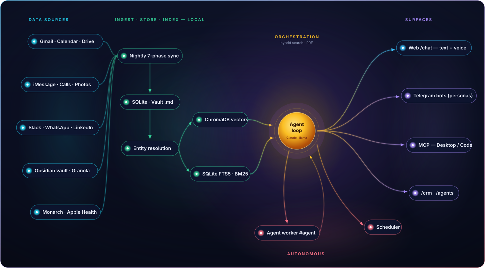
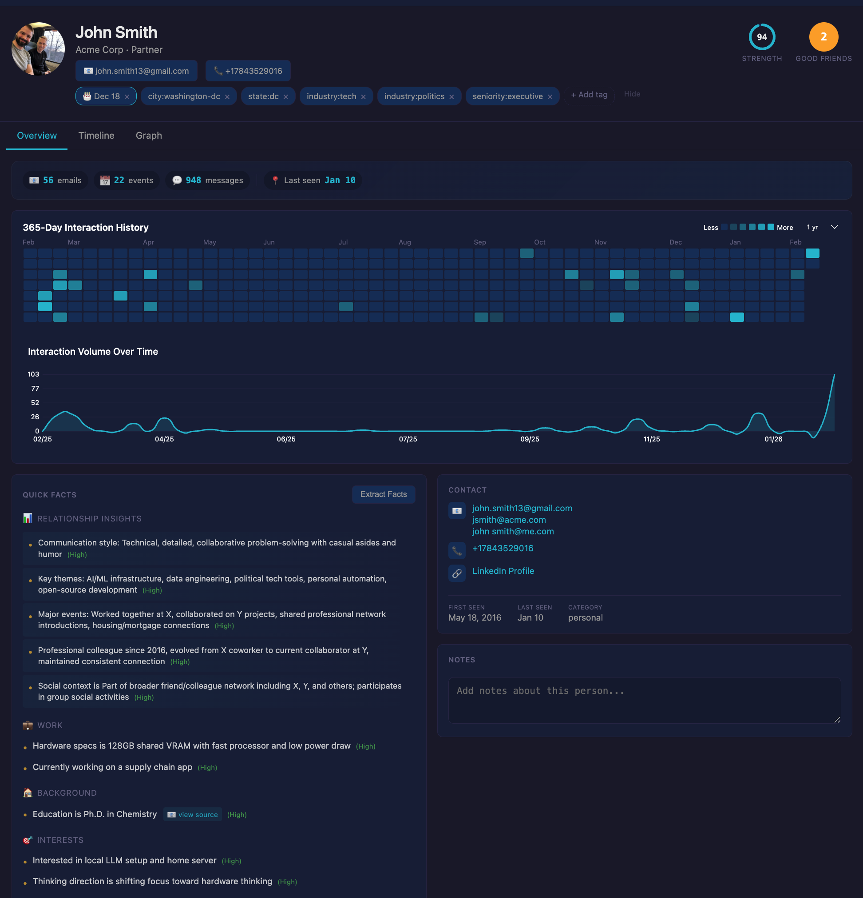
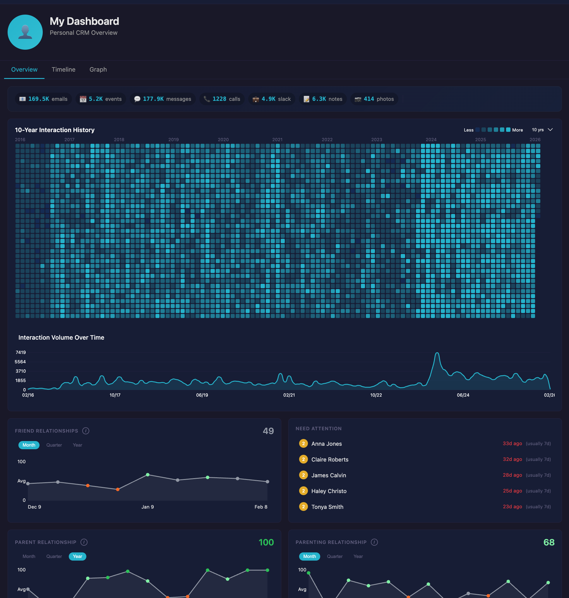
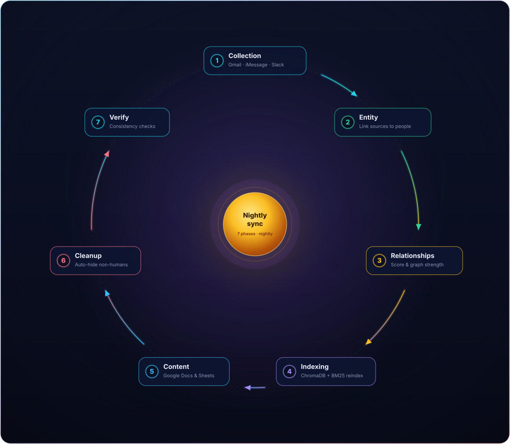
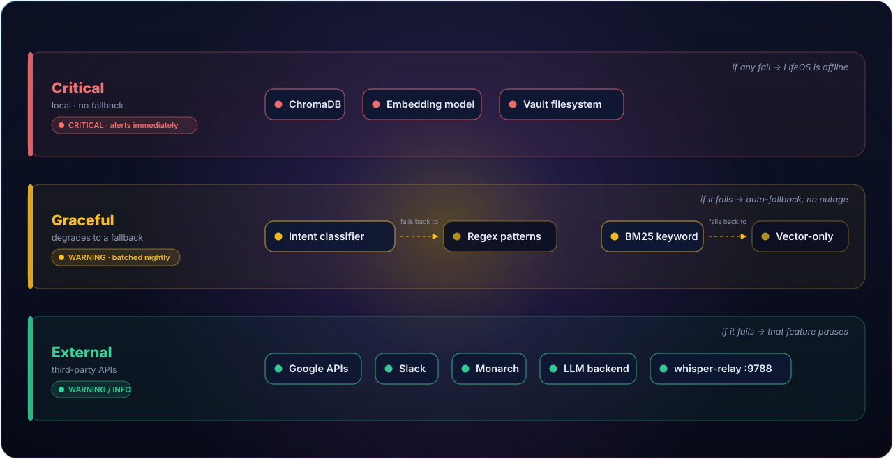

# LifeOS

**Your personal operating system, built from the digital exhaust of your life.**

LifeOS is a self-hosted AI assistant that connects to your Gmail, Google Calendar, Google Docs/Sheets/Drive, iMessage, phone calls, WhatsApp, Slack, Obsidian vault, Granola meeting transcripts, iPhotos, LinkedIn, Apple contacts, Monarch finances, and Apple Health — then makes all of it **available and actionable through natural language.**

**Front doors:** a web chat, Telegram, voice (wake word or push-to-talk, from a browser or an iOS Home Screen app), any MCP client (Claude Desktop, Claude Code), or a [Hermes](docs/specs/technical/client-surfaces.md) gateway that fronts your persona bots and falls back to LifeOS's native pipeline if Hermes is unreachable. It can answer from your data, take action on your behalf (draft email, schedule things, edit files), and hand long tasks to an autonomous agent that works while you don't.

All of your data is indexed and stored **locally** — your vault, messages, photos, financial summaries, and health data never leave your machine. By default, orchestration and synthesis call the Claude API (`LIFEOS_LLM_BACKEND=anthropic`, the default), which sends the current query and its retrieved context to Anthropic. For a no-API-key path, `LIFEOS_LLM_BACKEND=local` routes everything through a local llama-server on your own hardware, and `LIFEOS_LLM_BACKEND=remote` points at any OpenAI-compatible hosted provider (e.g. Fireworks) instead. A nightly sync pulls from your data sources, indexes everything for hybrid search (semantic + keyword), and keeps your relationship graph fresh.

> **New here?** Jump to [Quick Start](#quick-start), or the [Installation Guide](docs/guides/installation.md) for the full walkthrough (including a minimal "just an API key and a vault" path).

---

## What You Can Do

### Ask questions about your life

Search and synthesize across every channel you use — notes, emails, messages, calendar, docs, photos, finances — from one prompt:

- *"When did I last talk to Mom?"* / *"What's the context for my meeting with Acme Corp tomorrow?"* → quick answers and briefs
- *"What were the key recommendations Sarah made on the Acme project last month?"* → synthesized from hybrid semantic + keyword search across sources
- *"What should I get Jane for her birthday?"* → pulls context from years of history to generate tailored ideas

It also answers general-knowledge and web questions directly, and routes intelligently between your personal data, the web, and a stronger model when a query needs one.

### Talk to it your way

The same assistant, the same tools, on whichever surface fits the moment — all sharing one stable [client contract](docs/specs/technical/client-surfaces.md):

- **Web chat** at `/chat` — text or **voice**, with a persona picker and a per-turn model picker. See [Chat UI](docs/specs/product/chat-ui.md).
- **Voice** — tap to talk inside `/chat`, hear the reply. Same personas, models, and conversations as text. Setup: [Voice Guide](docs/guides/voice-setup.md).
- **Telegram** — a conversational bot plus proactive notifications, with specialized bots for specific personas. Setup: [Telegram Guide](docs/guides/telegram-setup.md).
- **MCP** — drive LifeOS's tools directly from Claude Desktop or Claude Code. See [MCP Tools](docs/specs/product/mcp-tools.md).

### Meet your assistants (personas)

LifeOS ships several selectable **personas** — one assistant, different personalities and scopes. All keep the full tool suite; they differ in tone, what they draw on, and how they respond:

- **primary** — general-purpose default: concise, proactive.
- **therapist** — advice-oriented; draws on your own reflections and inner-circle context, with strict privacy rules.
- **fitness** — a log-first trainer (see [Health & fitness](#health--fitness)).
- **finance** — a numbers-first financial planner: retirement, tax, allocation, and savings planning grounded in your real portfolio (see [Finances](#finances)).
- **doctor** — repairs LifeOS itself (see [Self-repair](#self-repair-the-doctor-bot)).

Pick a persona in `/chat`, or message its dedicated Telegram bot — they behave identically. Create your own with a markdown file. See the [Personas Guide](docs/guides/personas.md).

### Manage tasks, reminders, and schedules

- *"Remind me to follow up with John next Tuesday"* → a reminder, delivered on Telegram
- *"Next Wednesday I need to pull down my 1099 from Schwab"* → a task in your [task system](docs/specs/product/task-management.md) (Obsidian-backed)
- *"Every weekday at 9am, brief me on my calendar"* → a recurring **schedule**

Schedules go beyond reminders: a trigger (cron or one-off) fires an action — **notify** (a fixed message), **prompt** (run an LLM prompt and send the result), **endpoint** (call an internal API and send the result), or **agent** (hand the work to the autonomous agent). Empty results stay silent, so high-frequency checks don't become noise. See the [Scheduler Guide](docs/guides/scheduler.md).

### Proactive intelligence

The system doesn't just wait for you to ask — and stays quiet when there's nothing to say:

- Before meetings, it pushes a prep briefing with attendee context from your CRM
- Each morning, it summarizes your day: calendar, tasks, important emails
- Weekly, it flags people you've fallen out of touch with and nudges you

These are seedable [schedule](docs/guides/scheduler.md) entries — you can edit, extend, or add your own.

### Track relationships

Turn years of interaction history across thousands of contacts into insight — browse it in the [CRM UI](docs/specs/product/crm-ui.md):

- A ranked, searchable directory; per-person pages with contacts, sources, stats, and extracted facts; a [chronological timeline](docs/specs/product/crm-interactions.md) across all sources; and a force-directed [relationship graph](docs/specs/product/crm-graph.md).
- [Analytics dashboards](docs/specs/product/crm-analytics.md) — **Family**, **Me** (network health), **Birthdays**, and a **Relationship** dashboard for a designated partner.
- *"Who am I engaging with less than I used to? Who should I reconnect with?"* → interaction history, communication patterns, and relationship strength over time.

### Health & fitness

Log workouts in plain text and get trainer-grade guidance:

- *"bench 135x8, then 5x5 squats @185"* → parsed and recorded (optionally mirrored to a Google Sheet for phone viewing)
- *"what should I train today?"* → a recommendation informed by recent volume and recovery signals (sleep, resting HR, HRV, body weight) from [Apple Health](docs/guides/apple-health.md)

### Finances

Ask about your money, backed by Monarch:

- *"How much did I spend on restaurants last month?"* / *"Am I over budget on groceries?"* / *"What are my current investment holdings?"* → accounts, transactions, cashflow, budgets, and holdings.

### Remembers what matters

Tell it a fact or preference once — *"remember Jonathan goes by Jon"* — and it recalls it in future conversations, via the same hybrid semantic + keyword recall it uses for everything else.

### Safe by default

Email always **drafts first** and requires an explicit, separate confirmation before anything sends — on every surface.

---

## Hand off tasks to an autonomous agent

LifeOS includes an external **agent worker** that picks up tasks you've tagged `#agent` and completes them end-to-end while you do something else. Add a line to your task list and walk away — the agent runs it, marks the task done in your vault, and pings you on Telegram with the result and cost.

```
- [ ] TODO Summarize my unread emails from the partnership channel and reply with the top 3 by importance #agent
- [ ] TODO Find every meeting where we discussed the Q3 launch and list attendees #agent #local
- [ ] TODO Draft a follow-up to last week's intro with Acme. Budget $0.25 #agent
```

- **Hands-free completion.** Tag a task and forget it. Telegram tells you when it's done, what it did, and what it cost.
- **Choose your engine.** `#local` runs on your self-hosted Gemma — free, private, fast on workstation-class GPUs. `#cloud` runs on your configured `LIFEOS_REMOTE_LLM_*` provider (e.g. Fireworks); `#cloud-haiku` / `#cloud-sonnet` still route to Anthropic's [Managed Agents](docs/specs/product/agent-worker.md) with Gmail / Calendar / Drive / Slack / Asana / Ramp connectors out of the box. `#claude` and `#codex` hand off to those CLI engines. No tag, and the agent infers from the title.
- **Budgets in the title.** *"max $0.50"*, *"5 min"*, *"10k tokens"* — parsed in natural language. Daily and per-task caps are enforced from outside the agent loop, with a global daily $-ceiling backstop.
- **Asks when genuinely stuck.** An ambiguous task gets one targeted Telegram question; reply and the agent resumes. No answer within 72 hours (configurable) and the task is parked with a heads-up.
- **Spawns its own teammates.** Agents can spawn child sessions, message them, and yield until they finish — good for fan-out research and parallel pipelines.
- **Fully audited and restart-safe.** Every tool call, model turn, and cost delta is captured; a crash mid-task rolls back to `#agent` for retry (or resumes a still-running cloud session).

You can also run terminal, filesystem, and code tasks through **Claude Code** or **Codex** — via `/claude` / `/codex` on Telegram, "use claude code" in chat, or the `/chat` model picker (see [Claude Code / Codex orchestration](docs/specs/product/claude-code-orchestration.md)). Watch every running session — local, cloud, and CLI — on the live [`/agents`](docs/specs/product/agent-viz.md) page, whose primary view is a Kanban board of the work queue with the session graph as a secondary tab.

Set up: [Agent Worker Setup](docs/guides/agent-worker-setup.md). Full reference: [Product](docs/specs/product/agent-worker.md) · [Technical](docs/specs/technical/agent-worker.md).

---

## Self-repair: the doctor bot

When LifeOS itself misbehaves or is missing a capability, you don't file a bug — you tell the **doctor bot**. It talks through the goal with you, gets your one approval, then autonomously files a GitHub issue, ships a tested pull request (branch → review → merge), verifies the deploy landed, and reports back with a one-line revert handle if you want to undo it. See the [Doctor Bot Guide](docs/guides/doctor-bot.md).

---

## Quick Links

| Getting Started | Guides | Reference |
|-----------------|--------|-----------|
| [Installation](docs/guides/installation.md) | [Google OAuth](docs/guides/google-oauth.md) | [API Reference](docs/specs/product/api-reference.md) |
| [Configuration](docs/guides/configuration.md) | [Telegram](docs/guides/telegram-setup.md) · [Voice](docs/guides/voice-setup.md) | [MCP Tools](docs/specs/product/mcp-tools.md) |
| [First Run](docs/guides/first-run.md) | [Personas](docs/guides/personas.md) · [Scheduler](docs/guides/scheduler.md) | [Task Management](docs/specs/product/task-management.md) |
| | [Agent Worker Setup](docs/guides/agent-worker-setup.md) · [Doctor Bot](docs/guides/doctor-bot.md) | [Agent Worker](docs/specs/product/agent-worker.md) |
| | [Apple Health](docs/guides/apple-health.md) · [Slack](docs/guides/slack-integration.md) | [Troubleshooting](docs/guides/troubleshooting.md) |

---

## Requirements

- **Linux** (primary) or **macOS**
- **Python 3.11+**
- **ChromaDB** (installed via `pip`; the only hard external service)
- An **Obsidian vault** (or any folder of markdown notes)
- **A Claude API key** on the default backend — *or* a **GPU** (AMD ROCm / NVIDIA CUDA) to run everything locally — *or* an API key for any OpenAI-compatible hosted provider (e.g. Fireworks), for a no-local-GPU / no-Anthropic-key path

macOS is only required for native Apple integrations (iMessage, calls, Contacts, Photos) — LifeOS itself, including the local LLM, runs the same on macOS as on Linux, with `setup-launchd.sh` standing in for `setup-systemd.sh`. A Mac can also act as an [Apple Data Agent](docs/guides/operations.md) satellite, exporting Apple data nightly to a Linux host. Someone other than the maintainer can also install LifeOS config-only, talking to it through an external Hermes front door instead of running their own sync — see [Setting up for a second user](docs/guides/installation.md#setting-up-for-a-second-user-config-only).

### LLM options

Orchestration and synthesis run against the Claude API (default), a local OpenAI-compatible llama-server, or a hosted OpenAI-compatible provider. Pick what matches your hardware, budget, and privacy posture:

| Hardware / preference | Config | Notes |
|----------------------|--------|-------|
| No GPU / prefer cloud (default) | `LIFEOS_LLM_BACKEND=anthropic` + `ANTHROPIC_API_KEY` | Default model `claude-haiku-4-5` (override via `LIFEOS_ANTHROPIC_MODEL`). Query text + retrieved context is sent to Anthropic. |
| No GPU, no Anthropic key | `LIFEOS_LLM_BACKEND=remote` + `LIFEOS_REMOTE_LLM_URL`/`_MODEL`/`_API_KEY` | Any OpenAI-compatible endpoint (e.g. Fireworks). Query text + retrieved context is sent to that provider. |
| 8 GB RAM | `LIFEOS_LLM_BACKEND=local` + a small (~7B) model | Set `LIFEOS_LOCAL_LLM_URL` if not on `localhost:8080`. |
| 16–32 GB RAM | `LIFEOS_LLM_BACKEND=local` + a medium (~14–32B) model | |
| 64 GB+ VRAM | `LIFEOS_LLM_BACKEND=local` + a large (70–120B) model | Default local model: `unsloth/gemma-4-26B-A4B-it-GGUF`. |

To stay fully local, set `LIFEOS_LLM_BACKEND=local` and point `LIFEOS_LOCAL_LLM_URL` at a running llama-server. See the [Configuration Guide](docs/guides/configuration.md).

`LIFEOS_ANTHROPIC_MODEL` is the **base** orchestrator model. On top of it, per-query **escalation** (Anthropic backend only, off unless `LIFEOS_AGENT_ESCALATION_MODEL` is set) lets a turn run on a stronger model or hand off to a CLI engine:

- **User-directed:** *"escalate to opus"* / *"use sonnet"* runs that turn on the named model; *"use codex"* / *"use claude code"* hands off to that CLI worker.
- **Automatic:** when a turn wrongly refuses and you push back, LifeOS climbs to Claude Code, then — on a second push — to Codex. Automatic escalation only ever reaches engines that cost nothing per token (`claude_code`, `codex`, `local`); a stronger *API* model is something you ask for, never something LifeOS picks for you. `LIFEOS_AGENT_ESCALATION_MODEL` switches escalation on; `LIFEOS_AGENT_ESCALATION_LADDER` tunes the rungs.

---

## Quick Start

The minimal setup is an LLM credential and a folder of notes — everything else (Google, Slack, Telegram, Apple, voice, finances) is optional and layered on later. Two no-GPU paths:

```bash
# 1. Clone and install
git clone <your-fork-url> LifeOS
cd LifeOS
python3 -m venv ~/.venvs/lifeos
source ~/.venvs/lifeos/bin/activate
pip install -r requirements.txt

# 2. Configure
cp .env.example .env
# Edit .env — minimal required:
#   LIFEOS_VAULT_PATH   → your Obsidian/markdown folder
#
# Path A — Claude API key (default backend):
#   ANTHROPIC_API_KEY   → your Claude API key
#
# Path B — no Claude key, use any OpenAI-compatible hosted provider (e.g. Fireworks):
#   LIFEOS_LLM_BACKEND=remote
#   LIFEOS_REMOTE_LLM_URL, LIFEOS_REMOTE_LLM_MODEL, LIFEOS_REMOTE_LLM_API_KEY
#
# (or LIFEOS_LLM_BACKEND=local with a running llama-server on LIFEOS_LOCAL_LLM_URL,
# if you'd rather run inference on your own GPU)

# 3. Start the vector DB + server
./scripts/chromadb.sh start
./scripts/server.sh start

# 4. Open the app
#   http://localhost:8000/chat
```

For services that persist across reboots on Linux, run `sudo ./scripts/setup-systemd.sh` to install systemd units (macOS: `./scripts/setup-launchd.sh`).

After the first sync, `scripts/setup_identity.py` walks you through telling LifeOS who you are (guided, replaces hand-editing `.env`/`config/family_members.json`), and `scripts/first_backfill.py` runs a one-time deep backfill beyond the nightly sync's narrower lookback window — see [First Run](docs/guides/first-run.md).

Full walkthrough (including which external accounts each integration needs): [Installation Guide](docs/guides/installation.md).

---

## Architecture

Data flows from your sources, through local storage and indexing, into an orchestrator that answers queries and drives autonomous work across every surface:

<p align="center">
  
</p>

### Query pipeline

Most queries go straight to the orchestrator, which decides — over multiple rounds of tool calls — what to search and how to answer:

<p align="center">
  
</p>

The orchestrator defaults to Claude via the Anthropic API (`LIFEOS_LLM_BACKEND=anthropic`, model from `LIFEOS_ANTHROPIC_MODEL`); set `LIFEOS_LLM_BACKEND=local` to route through a local llama-server, or `LIFEOS_LLM_BACKEND=remote` to route through a hosted OpenAI-compatible provider instead. Internals: [Search & Indexing](docs/specs/technical/search-indexing.md) · [Architecture](docs/specs/technical/architecture.md).

### CRM UI

Translates years of interaction history with thousands of contacts into insight and visualization.

<strong>Per-person pages aggregating contact details and interaction history.</strong>



<strong>See how your communication patterns have evolved over the years.</strong>



<strong>Go deeper on your relationships with family and a designated partner.</strong>


<strong>Explore your relationships in a dynamic social graph.</strong>


---

## Data Sources

| Source | Method | Data |
|--------|--------|------|
| Obsidian | File watcher | Notes, mentions |
| Gmail (personal + work) | Google API | Emails, threads |
| Calendar (personal + work) | Google API | Events, attendees |
| Google Docs / Sheets | Google API | Document + tabular content |
| Google Drive | Google API | File search / content |
| iMessage / SMS | Apple Data Agent | Messages |
| Phone calls | Apple Data Agent | Call history |
| Contacts | Apple Data Agent | Names, emails, phones, birthdays |
| Photos | Apple Data Agent | Face recognition |
| WhatsApp | wacli → Apple Data Agent | Chat history |
| Slack | Slack API | DMs, channels, users |
| LinkedIn | CSV import | Connections |
| Monarch | Monarch API | Accounts, transactions, holdings |
| Apple Health | HealthBridge app / iOS Shortcut | Workouts, sleep, HR, HRV, weight |
| Granola | Vault file | Meeting transcripts |

Sources unify through **two-tier entity resolution** (SourceEntity → PersonEntity, linked by email → phone → fuzzy name) feeding **hybrid search** (ChromaDB vectors + SQLite FTS5/BM25, fused via Reciprocal Rank Fusion). See [Data & Sync](docs/specs/technical/data-and-sync.md) and [Data Model](docs/specs/product/data-model.md).

### Sync phases (nightly)

The unified nightly sync runs in 7 phases with dependencies:

<p align="center">
  
</p>

1. Collection must finish before Entity Processing can link records
2. Entity Processing must finish before Relationship Building has linked entities
3. Relationship Building must finish before Indexing has fresh CRM data
4. Content Sync runs last (indexed on the next cycle)
5. Entity Cleanup auto-hides obvious non-humans (noreply@, newsletters)
6. Consistency Verification checks orphaned records, stale merged IDs, and stats mismatches

### Service dependencies

Services are categorized by criticality and fallback behavior:

<p align="center">
  
</p>

**Alert severities:** CRITICAL (sent immediately — ChromaDB down, embedding failed, vault inaccessible) · WARNING (batched nightly — LLM API errors, backup failed) · INFO (log only). See [Operations](docs/guides/operations.md).

---

## Tech Stack

| Component | Technology |
|-----------|------------|
| Backend | FastAPI (port 8000) |
| LLM (orchestration + synthesis) | Claude via Anthropic API (default; `LIFEOS_ANTHROPIC_MODEL`, defaults to `claude-haiku-4-5`), a local llama.cpp server (`LIFEOS_LLM_BACKEND=local`), or any hosted OpenAI-compatible provider such as Fireworks (`LIFEOS_LLM_BACKEND=remote`) |
| Embeddings | sentence-transformers (`mxbai-embed-large-v1` by default; `gte-Qwen2-1.5B-instruct` is a supported upgrade) |
| Vector DB | ChromaDB (port 8001) |
| Keyword Search | SQLite FTS5 (BM25) |
| Intent classifier | Claude Haiku (Anthropic API), with a regex-pattern fallback |
| Voice | whisper-relay gateway (STT → orchestrator → TTS), reverse-proxied into `/chat` |
| Frontend | Vanilla HTML/JS (no build step) |
| Job Queue | SQLite (background reindex, sync) |
| Scheduler | Markdown source of truth + rebuildable index; 60s cron tick |
| Service Management | systemd (Linux) / launchd (macOS) |
| GPU Acceleration | ROCm (AMD) or CUDA (NVIDIA) |

---

## Documentation

### Getting started
- [Installation](docs/guides/installation.md) · [Configuration](docs/guides/configuration.md) · [First Run](docs/guides/first-run.md)
- [Google OAuth](docs/guides/google-oauth.md) · [Telegram](docs/guides/telegram-setup.md) · [Voice](docs/guides/voice-setup.md) · [Slack](docs/guides/slack-integration.md)
- [Personas](docs/guides/personas.md) · [Scheduler](docs/guides/scheduler.md) · [Apple Health](docs/guides/apple-health.md)
- [Agent Worker Setup](docs/guides/agent-worker-setup.md) · [Doctor Bot](docs/guides/doctor-bot.md) · [Operations](docs/guides/operations.md) · [Troubleshooting](docs/guides/troubleshooting.md)

### Product specs
- [Chat UI](docs/specs/product/chat-ui.md) · [CRM UI](docs/specs/product/crm-ui.md) · [CRM Analytics](docs/specs/product/crm-analytics.md)
- [Agent Worker](docs/specs/product/agent-worker.md) · [Agent Viz (`/agents`)](docs/specs/product/agent-viz.md) · [Claude Code / Codex](docs/specs/product/claude-code-orchestration.md)
- [MCP Tools](docs/specs/product/mcp-tools.md) · [Task Management](docs/specs/product/task-management.md) · [Data Model](docs/specs/product/data-model.md) · [API Reference](docs/specs/product/api-reference.md)

### Technical specs
- [Architecture](docs/specs/technical/architecture.md) · [Client Surfaces](docs/specs/technical/client-surfaces.md) · [Data & Sync](docs/specs/technical/data-and-sync.md)
- [Search & Indexing](docs/specs/technical/search-indexing.md) · [Agent Worker (Technical)](docs/specs/technical/agent-worker.md) · [Security & Privacy](docs/specs/technical/security-privacy.md)

### Architecture decisions
- [ADR Index](docs/adr/) — why Python/FastAPI, ChromaDB, hybrid search, local-first, and more

---

## Contributing

See [CONTRIBUTING.md](CONTRIBUTING.md) for guidelines.

---

## License

GNU General Public License v3.0 — see [LICENSE](LICENSE).

Third-party material redistributed here (currently the Apache-2.0 nickname dataset) is recorded in
[THIRD_PARTY_NOTICES.md](THIRD_PARTY_NOTICES.md).
